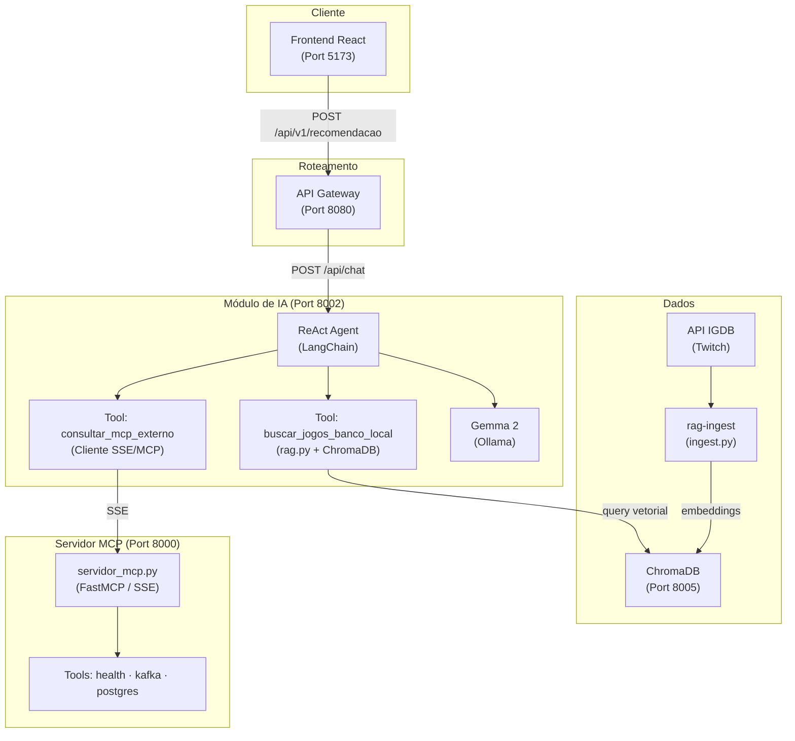

# 🎮 Game-Radar — Relatório Técnico

Integrantes: 

- Arthur Catarino de Oliveira
- Guilherme Fidélis Freire
- Heitor Ramos Vieira Rocha
- Mateus Correa Poddis


Sistema distribuído de recomendação de jogos eletrônicos baseado em RAG (Retrieval-Augmented Generation), LLM local via Ollama e arquitetura de microsserviços conteinerizada com Docker.

---

## Sumário

1. [Visão Geral](#1-visão-geral)
2. [Arquitetura do Sistema](#2-arquitetura-do-sistema)
3. [Componentes e Responsabilidades](#3-componentes-e-responsabilidades)
4. [Pipeline de Dados — Ingestão RAG](#4-pipeline-de-dados--ingestão-rag)
5. [Módulo de IA — Orquestração LangChain](#5-módulo-de-ia--orquestração-langchain)
6. [Protocolo MCP](#6-protocolo-mcp)
7. [Infraestrutura Docker](#7-infraestrutura-docker)
8. [Fluxo de uma Requisição](#8-fluxo-de-uma-requisição)
9. [Configuração e Execução](#9-configuração-e-execução)
10. [Variáveis de Ambiente](#10-variáveis-de-ambiente)
11. [Decisões de Projeto](#11-decisões-de-projeto)

---

## 1. Visão Geral

O Game-Radar recebe do usuário uma descrição livre de jogo desejado junto com filtros estruturados (gênero, plataforma, faixa de preço, faixa de ano). Um agente LangChain ReAct orquestra duas ferramentas: busca semântica no banco vetorial ChromaDB (RAG) e consulta de dados ao vivo via MCP. O LLM local Gemma 2 (via Ollama) sintetiza os resultados em uma recomendação personalizada em português.

**Stack principal:** FastAPI · LangChain 0.2.6 · Ollama (Gemma 2) · ChromaDB 0.5.3 · MCP 1.0.0 · Docker Compose

---

## 2. Arquitetura do Sistema



---

## 3. Componentes e Responsabilidades

| Serviço | Imagem / Build | Porta | Responsabilidade |
|---|---|---|---|
| `frontend` | `node:20-alpine` | 5173 | Interface React — formulário de filtros e chat |
| `api-gateway` | `python:3.12-slim` | 8080 | Roteamento HTTP, CORS, proxy para `ia-service` |
| `ia-service` | `python:3.11-slim` | 8002 | Agente LangChain ReAct + FastAPI |
| `mcp-gateway` | `python:3.11-slim` | 8000 | Servidor MCP (SSE) com tools de infraestrutura |
| `chromadb` | `chromadb/chroma:0.5.3` | 8005 | Banco vetorial persistente |
| `ollama` | `ollama/ollama:latest` | 11434 | Servidor de LLM e embeddings local |
| `rag-ingest` | `python:3.11-slim` | — | Job único de ingestão (profile `ingest`) |

---

## 4. Pipeline de Dados — Ingestão RAG

O script `ingest.py` executa uma única vez (ou sob demanda) para popular o ChromaDB com o catálogo de jogos.

**Etapas:**

1. **Autenticação** — obtém token OAuth2 da Twitch para acessar a API IGDB.
2. **Extração** — busca jogos em lotes de 100 (`BATCH_SIZE`), filtrando por `rating > 60`, `rating_count > 20` e `summary != null`, ordenados por popularidade. Total configurável via `TOTAL_GAMES` (padrão: 500).
3. **Transformação** — cada jogo é convertido em um documento de texto rico contendo nome, descrição, história, gêneros, temas, modos de jogo, perspectiva, palavras-chave, plataformas, desenvolvedor, ano e avaliação. A riqueza semântica do documento determina diretamente a qualidade dos embeddings.
4. **Metadados estruturados** — gravados junto ao vetor: `name`, `rating`, `release_year`, `genres`, `platforms`, `themes`. Permitem filtros no momento da busca sem varredura vetorial.
5. **Embedding e gravação** — o modelo `nomic-embed-text` (via Ollama) gera os vetores. O ChromaDB armazena com distância cosseno (`hnsw:space: cosine`). O `upsert` evita duplicatas em re-execuções.
6. **Rate limit** — pausa de 300ms entre lotes para respeitar o limite de 4 req/s da IGDB.

**Modelo de embedding:** `nomic-embed-text` — leve, eficiente e com bom desempenho semântico para inglês e português.

---

## 5. Módulo de IA — Orquestração LangChain

O `ia-service` expõe um endpoint `POST /api/chat` que recebe o payload do formulário e retorna a recomendação gerada pelo agente.

### 5.1 Agente ReAct

O padrão ReAct (Reasoning + Acting) foi adotado por compatibilidade com `langchain==0.2.6` e `ChatOllama`, que não suporta `bind_tools` (necessário para `create_tool_calling_agent`). O agente segue o ciclo:

```
Thought → Action → Action Input → Observation → (repete) → Final Answer
```

Parâmetros do `AgentExecutor`:

| Parâmetro | Valor | Motivo |
|---|---|---|
| `max_iterations` | 4 | Evita loop infinito com modelos menores |
| `early_stopping_method` | `"force"` | Força `Final Answer` ao atingir o limite |
| `handle_parsing_errors` | mensagem customizada | Recupera erros de formato sem travar |

### 5.2 Ferramentas (Tools)

**`buscar_jogos_banco_local(descricao: str)`**

Acessa o `rag.py` e executa busca semântica no ChromaDB. Se o contexto do formulário estiver disponível (`_contexto_requisicao`), usa `buscar_com_filtros_formulario`, que enriquece a query com as tags e aplica filtro de metadados por faixa de ano (`$gte` / `$lte`). Caso contrário, executa `buscar_jogos_rag` com busca simples. Retorna os 5 jogos mais similares com score de similaridade calculado como `(1 - distância_cosseno) * 100%`.

**`consultar_mcp_externo(nome_jogo: str)`**

Conecta ao `mcp-gateway` via SSE e chama a tool `check_services_health`. Em produção, este ponto seria expandido para consultar preços na Steam e disponibilidade em serviços de assinatura. Falhas são capturadas e retornadas como aviso — o agente continua sem travar.

### 5.3 Contexto Global

O padrão `_contexto_requisicao` (variável global limpa no `finally`) é necessário porque o LangChain invoca as tools por nome sem passar contexto externo. Isso permite que `buscar_jogos_banco_local` acesse os filtros do formulário (tags, faixa de ano) mesmo sendo chamada internamente pelo agente.

### 5.4 Montagem da Pergunta

O endpoint monta uma pergunta estruturada para o agente contendo: descrição livre, tags formatadas, faixa de preço em reais e faixa de ano de lançamento. As tags são limpas e concatenadas com ` | ` para facilitar o parsing pelo LLM.

---

## 6. Protocolo MCP

O `servidor_mcp.py` implementa um servidor MCP (Model Context Protocol) usando `FastMCP` com transporte SSE. Expõe três tools:

| Tool | Descrição |
|---|---|
| `check_services_health` | Retorna status dos serviços do API Gateway |
| `get_kafka_status(topic)` | Métricas de lag e partições ativas do Kafka |
| `query_postgres_metrics(service_name)` | Conexões ativas e tempo médio de query no PostgreSQL |

O cliente MCP no `ia-service` conecta via `sse_client` e mantém sessão com `ClientSession`, seguindo o protocolo de inicialização do MCP 1.0.0.

---

## 7. Infraestrutura Docker

### Rede

Todos os serviços compartilham a rede bridge `gamedar-network`, permitindo comunicação por nome de container (ex: `http://chromadb:8000`, `http://ollama:11434`).

### Volumes persistentes

| Volume | Dados persistidos |
|---|---|
| `ollama_data` | Modelos LLM e de embedding baixados |
| `chroma_data` | Embeddings e metadados dos jogos |

### Healthcheck do ChromaDB

O ChromaDB precisa de healthcheck para que o `ia-service` aguarde antes de iniciar:

```yaml
healthcheck:
  test: ["CMD", "curl", "-f", "http://localhost:8000/api/v1/heartbeat"]
  interval: 10s
  timeout: 5s
  retries: 10
  start_period: 20s
```

> **Atenção:** `wget` não está disponível na imagem `chromadb/chroma:0.5.3`. Use `curl`.

### Hot-reload de desenvolvimento

O `ia-service` monta `./modulo-ia:/app` como volume, permitindo alterações no código sem rebuild da imagem.

### Profile de ingestão

O `rag-ingest` usa `profiles: [ingest]` e só é executado explicitamente:

```bash
docker-compose --profile ingest up rag-ingest
```

---

## 8. Fluxo de uma Requisição

```
1. Usuário preenche formulário no Frontend (React)
        ↓
2. POST /api/v1/recomendacao → API Gateway (8080)
        ↓
3. POST /api/chat → ia-service (8002)
        ↓
4. Agente ReAct monta pergunta estruturada com descrição + tags + filtros
        ↓
5. Tool: buscar_jogos_banco_local
   → rag.py enriquece a query com tags
   → ChromaDB gera embedding via Ollama (nomic-embed-text)
   → Retorna top-5 jogos com score de similaridade
        ↓
6. Tool: consultar_mcp_externo
   → Conecta ao mcp-gateway via SSE
   → Chama check_services_health (ou tool de preço/disponibilidade)
        ↓
7. Gemma 2 sintetiza os dados e gera recomendação em português
        ↓
8. Resposta retorna pelo mesmo caminho até o Frontend
```

---

## 9. Configuração e Execução

### Pré-requisitos

- Docker Desktop instalado e em execução
- Credenciais da API IGDB (Twitch Developer Portal)

### 1. Configurar variáveis de ambiente

Crie um arquivo `.env` na raiz do projeto:

```env
TWITCH_CLIENT_ID=seu_client_id
TWITCH_CLIENT_SECRET=seu_client_secret
```

### 2. Subir a infraestrutura base

```bash
docker-compose up -d ollama chromadb
```

### 3. Baixar os modelos no Ollama

```bash
docker exec ollama ollama pull gemma2:2b
docker exec ollama ollama pull nomic-embed-text
```

### 4. Executar a ingestão do banco vetorial

```bash
docker-compose --profile ingest up rag-ingest
```

Aguarde a conclusão. O log deve terminar com `🎮 Ingestão concluída! 500 jogos no banco vetorial.`

### 5. Verificar a ingestão

```bash
curl http://localhost:8005/api/v1/collections
```

### 6. Subir todos os serviços

```bash
docker-compose up -d
```

### 7. Testar o RAG isoladamente

```bash
docker exec -it ia-service python3 -c "
from rag import buscar_jogos_rag
print(buscar_jogos_rag('jogo de RPG com boa história', n_resultados=3))
"
```

### 8. Acessar a aplicação

Abra `http://localhost:5173` no navegador.

---

## 10. Variáveis de Ambiente

| Variável | Serviço | Padrão | Descrição |
|---|---|---|---|
| `OLLAMA_BASE_URL` | ia-service, rag-ingest | `http://ollama:11434` | Endereço do servidor Ollama |
| `OLLAMA_MODEL` | ia-service | `gemma2:2b` | Modelo LLM para o agente |
| `CHROMA_HOST` | ia-service, rag-ingest | `chromadb` | Host do ChromaDB na rede interna |
| `CHROMA_PORT` | ia-service, rag-ingest | `8000` | Porta interna do ChromaDB |
| `MCP_GATEWAY_URL` | ia-service | `http://mcp-gateway:8000/sse` | Endpoint SSE do servidor MCP |
| `TWITCH_CLIENT_ID` | rag-ingest | — | Client ID da API IGDB |
| `TWITCH_CLIENT_SECRET` | rag-ingest | — | Secret da API IGDB |
| `GATEWAY_URL` | mcp-gateway | `http://api-gateway:8080` | URL do API Gateway para as tools MCP |
| `IA_SERVICE_URL` | api-gateway | `http://ia-service:8002` | URL do serviço de IA |

> **Atenção:** `CHROMA_PORT` no `rag.py` tem fallback `8005` (porta do host). Dentro da rede Docker, a porta correta é `8000`. Sempre defina a variável de ambiente explicitamente via `docker-compose.yml`.

---

## 11. Decisões de Projeto

**Por que `create_react_agent` e não `create_tool_calling_agent`?**
A versão `langchain==0.2.6` combinada com `ChatOllama` não implementa `bind_tools`, método exigido pelo `create_tool_calling_agent`. O padrão ReAct resolve o mesmo problema via prompt de texto estruturado, sem dependência de capacidades nativas de function calling do modelo.

**Por que variável global `_contexto_requisicao`?**
O LangChain invoca as tools apenas com os argumentos definidos na assinatura da função. Não há mecanismo nativo para injetar contexto externo. A variável global, limpa no `finally` de cada requisição, é a solução mais simples e segura para um serviço single-threaded com `asyncio`.

**Por que `nomic-embed-text` para embeddings?**
É um modelo compacto com bom desempenho semântico em português e inglês, disponível localmente via Ollama, sem custo de API. A distância cosseno (`hnsw:space: cosine`) é ideal para comparação de textos independentemente do comprimento.

**Por que ingestão separada com Docker profile?**
A ingestão é um job único que consome créditos de API da IGDB e tempo de processamento de embeddings. Isolá-la em um profile evita que seja re-executada acidentalmente em `docker-compose up` e permite reindexação controlada.

**Por que `upsert` no ChromaDB?**
Permite re-executar `ingest.py` para atualizar o catálogo sem duplicar registros, usando o ID numérico da IGDB como chave idempotente.