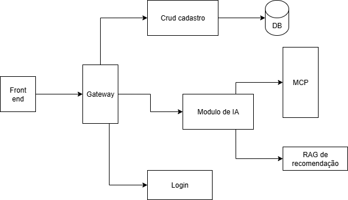

# Sistema Distribuído de Recomendação de Jogos (RAG + MCP)

Este projeto consiste em um sistema distribuído de recomendação personalizada de jogos eletrônicos. A arquitetura foi desenhada sob o paradigma de microsserviços para unir o poder de modelos de linguagem de código aberto (LLMs), recuperação de contexto semântico via RAG (Retrieval-Augmented Generation) e integração dinâmica com APIs de mercado através do protocolo MCP (Model Context Protocol).

---

## 1. Problema Escolhido

O cenário atual de consumo de jogos eletrônicos é fortemente impactado pelo **Paradoxo da Escolha**. Com a popularização de serviços de assinatura de streaming de jogos, como *Xbox Game Pass* e *PlayStation Plus*, os jogadores passaram a ter acesso instantâneo a catálogos massivos e quase ilimitados. 

No entanto, essa abundância gerou um efeito colateral conhecido como "paralisia de análise": diante de centenas de opções, o usuário frequentemente trava, gasta mais tempo navegando nos menus do que efetivamente jogando e, muitas vezes, não escolhe nada. Quando escolhem, a falta de alinhamento real com seu momento ou preferência faz com que a taxa de abandono de jogos pela metade seja altíssima.

Nesse contexto de sobrecarga de informações, os sistemas de recomendação tradicionais falham em auxiliar o jogador devido a duas limitações principais:

1. **Rigidez Algorítmica:** Filtros baseados puramente em tags estruturadas (ex: "Ação", "RPG") não capturam nuances subjetivas. Um jogador não quer apenas um "RPG de ação", ele quer *“um jogo com atmosfera melancólica, foco em narrativa e que não seja punitivo para jogar depois de um dia cansativo de trabalho”*.
2. **Isolamento de Modelos de IA:** Modelos de Linguagem (LLMs) tradicionais possuem conhecimento estático limitado à sua data de treinamento. Eles não conseguem consultar em tempo real se um jogo está em promoção na Steam, se entrou no catálogo do Game Pass hoje ou comparar preços dinâmicos no mercado.

**A Solução:** Este sistema resolve a paralisia da escolha unindo o melhor dos mundos. Ele utiliza bancos de dados relacionais (para dados cadastrais), um banco vetorial RAG (para entender a fundo as características subjetivas dos jogos) e um ecossistema MCP para atuar como os "braços e olhos" da IA no mundo real. Dessa forma, o sistema não apenas recomenda o jogo perfeito para o humor atual do usuário, mas já informa onde ele está mais barato ou disponível, quebrando a barreira da indecisão.

---

## 2. Arquitetura Proposta

A arquitetura adota o padrão de microsserviços distribuídos, garantindo o desacoplamento das responsabilidades, facilidade de manutenção e escalabilidade independente de cada componente. 

O ecossistema é totalmente conteinerizado, isolando a camada de controle de acesso e dados transacionais (construída sobre a robustez do ecossistema Java/Spring) da camada de inteligência artificial e integração de ferramentas (construída sobre a flexibilidade do ecossistema Python e IA).

---

## 3. Componentes e Tecnologias Utilizadas

Para garantir o desacoplamento, a escalabilidade e o melhor uso de cada ecossistema (Java para segurança e Python para IA), o sistema foi dividido nos seguintes módulos tecnológicos:

* **Frontend (React com TypeScript):** Interface SPA (Single Page Application) responsável por coletar as preferências do usuário, renderizar o catálogo de recomendações e coletar feedbacks. O React foi escolhido por sua reatividade e ecossistema robusto na construção de formulários interativos.
* **API Gateway (FastAPI - Python):** Ponto de entrada único para o Frontend que intercepta requisições, valida tokens e roteia as chamadas. Escolhido pela sua altíssima performance, tipagem nativa com Pydantic e facilidade na criação de middlewares de roteamento rápidos.
* **Módulos de Autenticação e CRUD (Spring Boot - Java 17+):** Serviços críticos isolados que gerenciam dados cadastrais, emitem tokens JWT e controlam acessos. O Spring Boot foi escolhido pela maturidade corporativa, segurança nativa (Spring Security) e robustez na persistência de dados.
* **Banco de Dados Relacional (PostgreSQL):** Instância dedicada para os microsserviços em Spring. Como líder em código aberto para persistência ACID, garante integridade absoluta para as tabelas de usuários, credenciais e relacionamentos.
* **Módulo de Inteligência Artificial (LangChain + Ollama):** O núcleo cognitivo do sistema. O **LangChain** atua como o framework orquestrador para gerenciar os prompts e conectar a IA aos dados externos. O **Ollama** atua como o motor, permitindo a execução local de modelos de linguagem (LLMs) em contêineres Docker, o que garante privacidade e custo zero por token.
* **Memória Semântica / RAG (Banco de Dados Vetorial):** Responsável por armazenar os embeddings (representações vetoriais) dos jogos indexados, permitindo que a IA faça buscas de similaridade para entender características subjetivas solicitadas pelo usuário.
* **Servidor de Integração (Protocolo MCP via Python SDK):** Atua como o provedor de dados vivos para a IA. Utilizando o Model Context Protocol, expõe funções padronizadas para que o modelo possa comparar preços em tempo real através da API externa CheapShark.
* **Infraestrutura e Orquestração (Docker & Docker Compose):** Todo o ecossistema é conteinerizado. Isso permite que módulos e serviços complexos (PostgreSQL, Ollama, Spring, FastAPI) sejam empacotados, isolados e inicializados simultaneamente de forma simples.

---

## 4. Fluxo de Dados

O ciclo de vida de uma requisição de recomendação segue o fluxo abaixo:

1.  **Autenticação:** O usuário realiza o login pelo Frontend. O `Módulo de Login` valida as credenciais no `PostgreSQL` e devolve um token JWT. O Frontend armazena este token para as próximas requisições.
2.  **Requisição de Recomendação:** O usuário preenche o formulário de preferências atuais e clica em buscar. A requisição viaja com o JWT até o `API Gateway`, que valida o token e a redireciona para o `Módulo de IA`.
3.  **Recuperação de Contexto (RAG):** O `Módulo de IA` intercepta a requisição e, antes de consultar o modelo, faz uma busca de similaridade no `Banco Vetorial (RAG)` usando as informações passadas pelo formulário.
4.  **Consulta de Ferramentas (MCP):** Com os jogos buscados, o framework `LangChain` percebe a necessidade de dados dinâmicos de mercado e aciona o `Servidor MCP`. O MCP faz chamadas externas para as API CheapShark buscando informações atuais dos jogos.
5.  **Geração da Resposta:** O `LangChain` injeta o contexto do RAG e os dados vivos do MCP dentro de um prompt estruturado e o envia para o modelo de linguagem local rodando no `Ollama`. O modelo processa e gera uma recomendação textual altamente personalizada e humanizada.
6.  **Exibição e Feedback Loop:** A resposta retorna pelo Gateway até o Frontend. O usuário pode interagir com o resultado dando feedback sobre os jogos recomendados.
